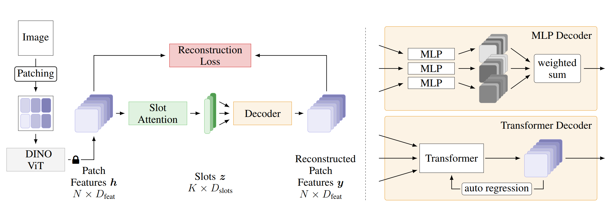

# Bridging the Gap to Real-World Object-Centric Learning
This is the **UNOFFICIAL** PyTorch implementations of papers *Bridging the Gap to Real-World Object-Centric Learning* [1] published in ICLR 2023 and *Invariant Slot Attention: Object Discovery with Slot-Centric Reference Frames* [2] published in ICML 2023.



This repository extends the original DINOSAUR model using [Invariant Slot Attention](https://arxiv.org/abs/2302.04973) and [DINOv2](https://arxiv.org/abs/2304.07193) backbone.

## Training
After installing COCO dataset to /path/to/coco and Pascal VOC to /path/to/pascal_voc12, you can train the model:
```
torchrun --master_port=12345 --nproc_per_node=#GPUs \
train.py \
--dataset {coco, pascal_voc12} \
--root /path/to/{coco, pascal_voc12} \
--model_save_path /path/to/save \
--encoder "dinov2-vitb-14" \
--ISA
```

## Results

### COCO
This is the expected object discovery performance of the models using the MLP decoder in COCO
| Model | mBO<sup>i</sup> | mBO<sup>c</sup> | mIoU | FG-ARI |
| :--- | :---: | :---: | :---: | :---: |
| DINOSAUR (reported) | 26.1 | 30.0 | - | 39.4 |
| DINOSAUR (my reproduction) | 28.0 | 31.7 | 20.4 | 40.2 |
| DINOSAUR + DINOv2 | 30.3 | 34.3 | 22.3 | 44.9 |
| DINOSAUR + DINOv2 + ISA | **30.9** | **34.4** | **22.7** | **45.8** |

### Pascal VOC
This is the expected object discovery performance of the models using the MLP decoder in Pascal VOC
| Model | mBO<sup>i</sup> | mBO<sup>c</sup> | mIoU | FG-ARI |
| :--- | :---: | :---: | :---: | :---: |
| DINOSAUR (reported) | **39.3** | 40.8 | - | 24.6 |
| DINOSAUR (my reproduction) | 39.1 | **42.9** | **23.3** | **26.1** |
| DINOSAUR + DINOv2 + ISA | 37.3 | 40.7 | 22.4 | 24.3 |

## Acknowledgments

This work is built on the official implementation of [SOLV](https://github.com/gorkaydemir/SOLV), "Self-supervised Object-Centric Learning for Videos" published in NeurIPS 2023.

## References

[1] Seitzer, Maximilian, et al. "Bridging the gap to real-world object-centric learning.", ICLR 2023

[2] Biza, Ondrej, et al. "Invariant slot attention: Object discovery with slot-centric reference frames.", ICML 2023